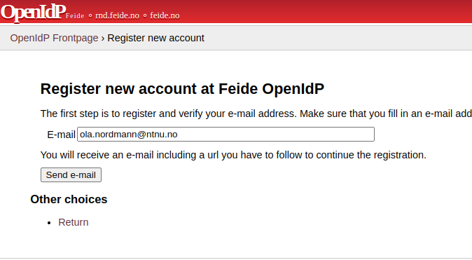
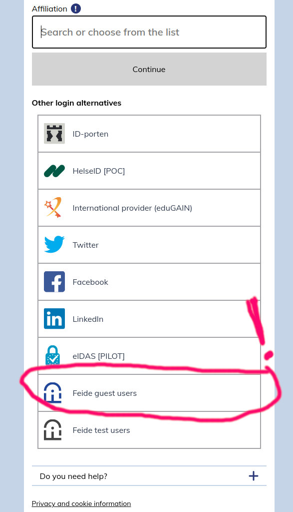

**MOL8012 - High-Throughput Genomics**

# Notebook login setup
1) **Create an OpenIDP account** [https://openidp.feide.no](https://openidp.feide.no)

2) **Log in on dataporten with your new OpenID account** [https://minside.dataporten.no](https://minside.dataporten.no) as **Feide guest users** not the usual Feide login!

3) **Click on the Invitation link you received in the e-mail**     
**Now you should be ready to use the server!**  


# Practical bioinformatics

1. Log into the server by going to following [mol8012-2023.gcf.sigma2.no](https://mol8012-2023.gcf.sigma2.no)


Hopefully, you will now see get a webpage notebook and this is the interface to your remote server


2. Go into the *shared-gcf-ns9689k* directory (anything stored under this folder will be present if you log in again at a later time point. Then go to the folder with your name. E.g for me, there will be a folder named `arnar`. If your name is not present, you can create one by right-clicking and choosing `create folder`. Name the folder something unique for yourself.

3. Open a terminal window (from the launcher tab).


In the terminal we will change the directory to your specific directory and then clone data and notebooks from our github repository:
>What is `cd` in the Linux terminal?
>
>The cd command (_change directory_) accepts several types of arguments. We will go through the most frequently used ones.
>
> `cd /`
>To go to the root directory, we input `/` as the argument.
>
> `cd`
>We do not provide any arguments to the cd command to go to the home directory.
>
> `cd ..`
>To shift one level above the current directory, we input .. as the argument.
>
> `cd -`
>To go to the previous directory, we use - as our argument.
>
> `cd /folder/subfolder`
>For custom navigation across any directory, we can send its path as the argument.
>
> Other useful commands are:  
>  `ls` 
>_list directory contents_  
> `pwd`
>_print working directory_

Navigate in the terminal to **your folder** (this example code is for my folder named arnar)
```
cd shared-gcf-ns9689k/arnar
```
And fetch data and code (download code and data from github) 
```
git clone https://github.com/gcfntnu/mol8012-2019.git
```


4. Open the mol8012-2019 folder and double-click on either the 01 or 02 notebook. The first notebook is essential just to show you what is needed to create a differential expression result from a count matrix. The first notebook will be covered in a walk-through and generates data used as input in the second notebook. The second notebook describes your home assignment and is focused on the interpretation of a gene expression result.

**Good luck**
