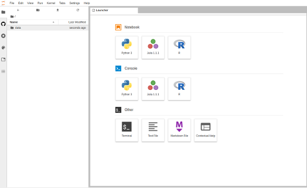
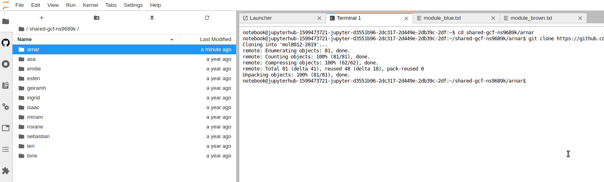

**MOL8012 - High-Throughput Genomics**

# Practical bioinformatics

1. Log into the server by goint to following [mol8012-2019.gcf.sigma2.no](https://mol8012-2019.gcf.sigma2.no)

Hopefully you will now see get a wepage notebook and this is the interface to your remote server


2. Go into the *data* directory (anything stored under this folder will be present if you log in again at a later timepoint. Then go to the folder with your name. E.g for me, there will be a folder named `arnar`. If your name is not present, you can create one by right clicking and choose create folder. Name the folder something unique for yourself.

3. Open a terminal window (from the launcher tab). In the terminal we will change directory to your specific directory and then clone data and notebooks from our github repository:
```
cd data/arnar
git clone https://github.com/gcfntnu/mol8012-2019.git
```




4. Open the mol8012-2019 folder and double click on either the 01 or 02 notebook. The first notebook is essential just to show you what is needed to create a differential expression result from a count matrix. The first notebook will be covered in a walk-through and generates data used as input in the second notebook. The second notebook describes your home assignemnt and is focused on interpretation of a gene expression result.

**Good luck**
