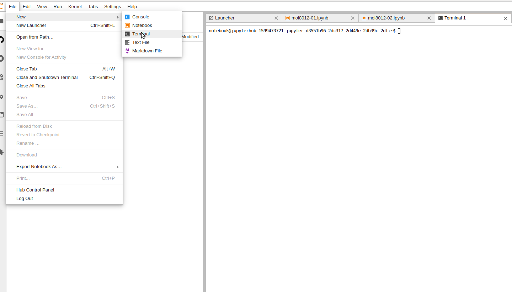

**MOL8012 - High-Throughput Genomics**

# Notebook login setup
1) Create an OpenIDP account [https://openidp.feide.no](https://openidp.feide.no)
2) Log in on dataporten with your new OpenID account [https://minside.dataporten.no](https://minside.dataporten.no) as **Feide guest users** not the usual Feide login!
3) Click on the Invitation link you received in e-mail [https://minside.dataporten.no//#invitation/c56921e4-1178-4226-bcde-ab82f19c6dca/325c4e26-0c06-4c8f-8185-7e72d1e582ea](link)

# Practical bioinformatics

1. Log into the server by goint to following [mol8012.gcf.sigma2.no](https://mol8012.gcf.sigma2.no)

Hopefully you will now see get a wepage notebook and this is the interface to your remote server


2. Go into the *shared-gcf-ns9689k* directory (anything stored under this folder will be present if you log in again at a later timepoint. Then go to the folder with your name. E.g for me, there will be a folder named `arnar`. If your name is not present, you can create one by right clicking and choose create folder. Name the folder something unique for yourself.

3. Open a terminal window (from the launcher tab).


In the terminal we will change directory to your specific directory and then clone data and notebooks from our github repository:
```
cd shared-gcf-ns9689k/arnar
git clone https://github.com/gcfntnu/mol8012-2019.git
```


4. Open the mol8012-2019 folder and double click on either the 01 or 02 notebook. The first notebook is essential just to show you what is needed to create a differential expression result from a count matrix. The first notebook will be covered in a walk-through and generates data used as input in the second notebook. The second notebook describes your home assignemnt and is focused on interpretation of a gene expression result.

**Good luck**
