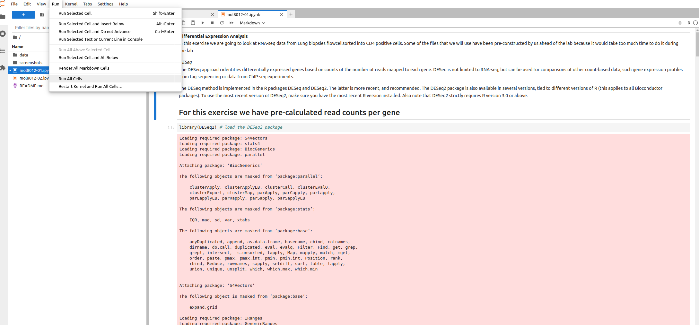

**MOL8012 - High-Throughput Genomics**  
The practical bioinformatic session uses a sigma2 remote server with a [jupyter notebook](https://jupyter.org/).  
This documentation will describe:  
* Login to remote server
* Download rna-seq data for analysis
* Download code for analysis of rna-seq data (notebooks)
* Run notebook analysis 

# Notebook login setup
1) **Create an OpenIDP account** [https://openidp.feide.no](https://openidp.feide.no)

2) **Log in on dataporten with your new OpenID account** [https://minside.dataporten.no](https://minside.dataporten.no) as **Feide guest users** not the usual Feide login!

3) **Click on the Invitation link you received in the e-mail**     
**Now you should be ready to use the server!**  


# Practical bioinformatics

1. Log into the server by going to [mol-8012.gcf.sigma2.no](https://mol-8012.gcf.sigma2.no/)


Hopefully, you will now see get a webpage notebook and this is the interface to your remote server


3. Open a terminal window (from the launcher tab).


In the terminal we will create a new directory for your personal project and then clone data and notebooks from our github repository.

>What is `mkdir` in the Linux terminal?
>
> The mkdir command (_make directory_) accepts the new name of a directory. `mkdir arnar` will create a new directory with name arnar
>What is `cd` in the Linux terminal?
>
>The cd command (_change directory_) accepts several types of arguments. We will go through the most frequently used ones.
>
> `cd /`
>To go to the root directory, we input `/` as the argument.
>
> `cd`
>We do not provide any arguments to the cd command to go to the home directory.
>
> `cd ..`
>To shift one level above the current directory, we input .. as the argument.
>
> `cd -`
>To go to the previous directory, we use - as our argument.
>
> `cd /folder/subfolder`
>For custom navigation across any directory, we can send its path as the argument.
>
> Other useful commands are:  
>  `ls` 
>_list directory contents_  
> `pwd`
>_print working directory_

Navigate in the terminal to **your folder** (this example code is for my folder named arnar)
```
cd arnar
```
And fetch data and code (download code and data from github) 
```
git clone https://github.com/gcfntnu/mol8012-2019.git
```


4. Open the mol8012-2019 folder and double-click on either the 01 or 02 notebook. The first notebook is essential just to show you what is needed to create a differential expression result from a count matrix. The first notebook will be covered in a walk-through and generates data used as input in the second notebook. The second notebook describes your home assignment and is focused on the interpretation of a gene expression result.

>What is Jupyter Notebook?  
>A Jupyter Notebook consists of three main components: cells, a runtime environment, and a file system. Cells are the individual units of the notebook, and they can contain either text or code
>
>You can run one cell by hitting `shift-enter`. Or you can run one or multiple cells from the run tab.  
>At any time you may restart the analysis by selecting from the menu: `kernel -> Restart Kernel and Clear Outputs of All Cells`



Jupyterlab documentation (https://jupyterlab.readthedocs.io/en/latest/)

**Good luck**
